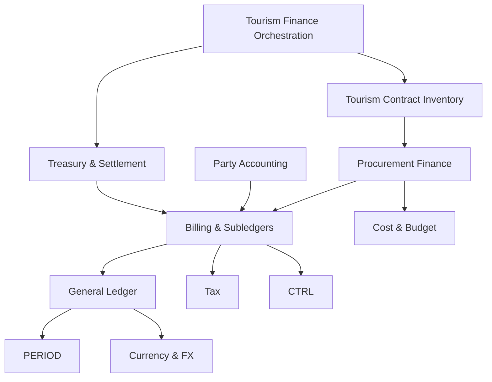

# Accounting Dependency Graph

## Relationship types

Only **compile-time/module imports** form the package graph. The other four relationship types do not authorize an import:

| Type | Meaning | Cycle rule |
|---|---|---|
| Compile-time/module import | consumer imports provider's published application port | included in DAG; one direction only |
| Shared contract | both import DTO/event schema from approved neutral contracts package | not a module edge |
| Event flow | producer publishes immutable event without knowing consumers | not a reverse import |
| Orchestration flow | caller/composition root invokes multiple public ports | modules do not import the orchestrator or one another in reverse |
| Projection consumption | event-fed rebuildable read model | no repository/table access and no source-module import |

## Authoritative compile-time import DAG

An arrow means **consumer imports provider**. Modules not shown as a target have no module import merely because they consume events/projections.

The complete edge list (including edges omitted from the compact diagram for readability) is:

| Consumer | Allowed synchronous provider imports |
|---|---|
| Financial Controls & Reconciliation | none |
| Currency & FX | none |
| Tax | none |
| Cost & Budget Accounting | none |
| Period Control | none |
| General Ledger | Period Control; Currency & FX |
| Billing & Subledgers | Tax; Currency & FX; General Ledger; Period Control; Financial Controls & Reconciliation |
| Treasury & Settlement | Billing & Subledgers; Currency & FX; General Ledger; Period Control; Financial Controls & Reconciliation |
| Party Accounting | Billing & Subledgers; General Ledger; Financial Controls & Reconciliation |
| Expense, Commission & Recognition | Billing & Subledgers; Treasury & Settlement; General Ledger; Period Control; Currency & FX; Financial Controls & Reconciliation |
| Assets & Financing | Billing & Subledgers; Treasury & Settlement; General Ledger; Period Control; Currency & FX; Financial Controls & Reconciliation |
| Procurement Finance | Billing & Subledgers; Cost & Budget Accounting; Financial Controls & Reconciliation |
| Tourism Contract Inventory | Procurement Finance |
| Tourism / Hajj / Umrah Finance Orchestration | Cost & Budget Accounting; Tourism Contract Inventory; Procurement Finance; Billing & Subledgers; Treasury & Settlement; Expense, Commission & Recognition; Financial Controls & Reconciliation |
| Financial Reporting | none; shared events/projections only |

## Topological order proof

Provider-first topological order:

1. Currency & FX
2. Tax
3. Cost & Budget Accounting
4. Period Control
5. General Ledger
6. Financial Controls & Reconciliation
7. Billing & Subledgers
8. Treasury & Settlement
9. Party Accounting
10. Expense, Commission & Recognition
11. Assets & Financing
12. Procurement Finance
13. Tourism Contract Inventory
14. Tourism / Hajj / Umrah Finance Orchestration
15. Financial Reporting

For every edge in the authoritative table, the provider appears before the consumer. Therefore the compile-time module graph is a DAG and has zero cycles.

## Explicit cycle breaks

| Apparent collaboration | Sole synchronous direction | Reverse path without import |
|---|---|---|
| GL / Period | GL → Period: authorize posting date | Period returns a year-close posting instruction to caller-owned orchestration; the orchestrator submits it to GL. Period consumes close result as an immutable event/result. |
| GL / FX | GL → FX: resolve dated rate/snapshot | FX prepares revaluation instruction; authorized orchestration submits it to GL. FX receives result by shared-contract event. |
| GL / Cost | no module import in either direction | GL carries opaque cost-center ID from shared contract. Cost consumes JournalPosted events into a rebuildable actual/profit projection. Validation occurs before GL call or by contract-level identifier rules. |
| Controls / source owners | source owner → Controls: request approval/decision | Controls consumes event-fed projections or immutable evidence supplied by query/orchestration layer; it never imports owner modules. Remediation calls are made by an orchestrator. |
| Billing / Treasury | Treasury → Billing: query outstanding and apply/reverse allocation | Billing publishes allocation events; Treasury stores immutable allocation IDs/projection only. Billing never imports Treasury. |
| Billing / Tax | Billing → Tax: snapshot tax | Tax reconciliation consumes invoice/GL events/projections. |
| Procurement / Billing | Procurement → Billing: create/query supplier invoice | Billing emits invoice reversal/outcome events; Procurement reopens from events. |
| Inventory / Procurement | Inventory → Procurement: blocker query | Inventory emits shortage/cost events; procurement consumes them through event subscription/composition, not an Inventory import. |
| Reporting / all owners | none | Reporting consumes event-fed projections and shared read contracts only. |

## Enforcement

1. Module source may import another module only when the edge appears in the authoritative table and only through its published application port.
2. Shared contracts live outside every business module and contain no infrastructure or implementation.
3. Domain/infrastructure internals and Prisma repositories are private.
4. Events contain immutable values/references, never ORM entities.
5. Architecture tests must build the import graph, assert the exact allowlist, reject cycles/private imports/foreign repositories, and verify the topological order above.
